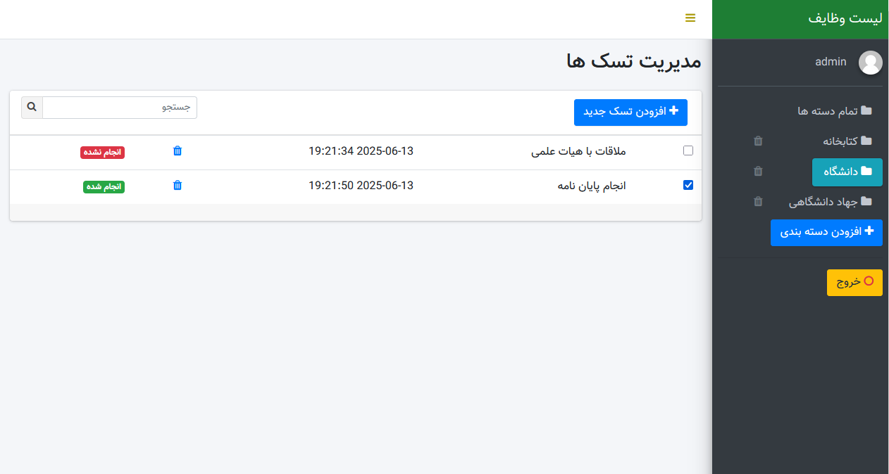

# 📝 لیست وظایف با PHP و PDO

یک اپلیکیشن ساده مدیریت وظایف (To-Do List) ساخته‌شده با **PHP** و **PDO**.

## 🚀 امکانات
- افزودن، ویرایش و حذف وظایف  
- ذخیره‌سازی وظایف در پایگاه داده MySQL  
- رابط کاربری تمیز و واکنش‌گرا (Bootstrap)
- امکان ورود و ثبت نام کاربر 
- امکان جستجوی تسک به صورت ایجکس  
- سبک و آسان برای راه‌اندازی  

## 📦 تکنولوژی‌های استفاده‌شده
- نسخه ی php 7.4 به بالا
- رابط کاربری با فریمورک bootstrap
- رابط دیتابیس pdo

## ⚙️ نحوه اجرا 
1. یک پایگاه داده به نام `todo` ایجاد کنید.  
2. فایل SQL را در پایگاه داده MySQL خود وارد کنید (`todo.sql`).  
3. اطلاعات اتصال به پایگاه داده را در فایل `bootstrap/config.php` تنظیم کنید.  
4. پروژه را روی سرور محلی خود (مثل XAMPP) اجرا کنید.  
5. به آدرس `localhost/todo` بروید.  
6. اطلاعات کاربر ادمین:  
   - نام کاربری: `admin`  
   - ایمیل: `admin@gmail.com`  
   - رمز عبور: `123456`

## 📷 تصویر نمونه

## 📄 مجوز
استفاده رایگان برای اهداف آموزشی یا استفاده در نمونه‌کار (پورتفولیو) مجاز است.

---

